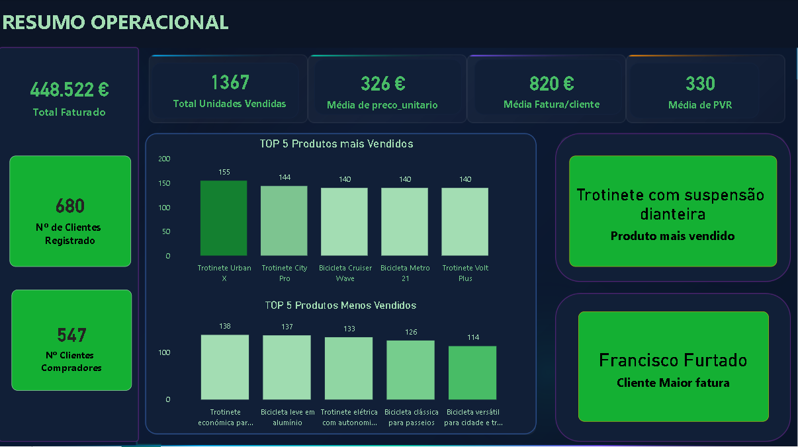

# Project-Power-BI-_Store-Sales-Analysis

  

## Projeto Power BI
- Esse projeto apresenta um dashboard de vendas, com base no dataset de produtos, vendas e clientes de uma loja de bicicletas
- O foco foi transformar, modelar e analisar dados de forma clara. Para ajudar a entender o comportamento das vendas e dos clientes. 

## Objetivo
 - Contruir um dashboard com as pricipais informações da loja
 - Apresentar qual produto vende mais e qual cliente comprou mais na loja

## Modelação no Power Query 
Durante o processo foram plicadas algumas etapas
- Importação do xls para o Power Bi
- Modelagem dos dados ( mudança dos tipos de variáveis strings para interio e decimais )
- Contrução do Diagrama ER para que as tabelas se comunicassem
- Criação de Medidas DAX para ajudar a responder as perguntas 
- Algumas medidas importantes

Objetivo da Medida Dax
- Devolver o Nome do cliente com maior soma de 'vendas'[Total da Fatura].

  #Cliente_ID Mais Vendas =
MAXX (
    TOPN (	-- TOPN Devolve um determinado numero de linhas
        1,  -- escolhe apenas o TOP 1 (uma única linha)
   SUMMARIZE (					-- SUMMARIZE Cria um resumo da tabela agrupandas pelas colunas especificadas
            'Vendas',                -- tabela base (fonte dos registos de vendas)
            'Vendas'[cliente_id],    -- chave de agrupamento (1 linha por cliente)
   "QtdTotal",              -- nome da coluna agregada (total por cliente)
            SUM ( 'Vendas'[Total da Fatura] )  -- soma da faturação no contexto atual (datas/filtros/etc.)
        ), [QtdTotal],  -- ordenação principal (maior total primeiro)
        DESC,        -- direção da ordenação principal (descendente)

  'Vendas'[cliente_id],  -- critério de desempate (ID do cliente)
        ASC                   -- direção do desempate (ascendente)),
   Vendas'[cliente_id]  -- valor devolvido: cliente_id da linha vencedora (TOP 1)
)

Objetivo da Medida Dax
- Devolver o Nome do produto que mais vendeu não o ID'vendas'[Produto_ID].

   Nome do produto mais vendido = 
   VAR IdTop =
       MAXX (
           TOPN (
               1,
               SUMMARIZE (
                   'Vendas',
                   'Vendas'[Produto_ID],
                   "QtdTotal", SUM ( 'Vendas'[Quantidade] )
               ),
               [QtdTotal], DESC,
               'Vendas'[Produto_ID], ASC
           ),
           'Vendas'[Produto_ID]
       )
   RETURN
       CALCULATE (
           SELECTEDVALUE ( 'Produtos'[Nome] ),
           'produtos'[id] = IdTop
       )
   	

## Conclusão 
- Foi possível verificar qual produto mais vendido e qual o nome do cliente com maior fatura

